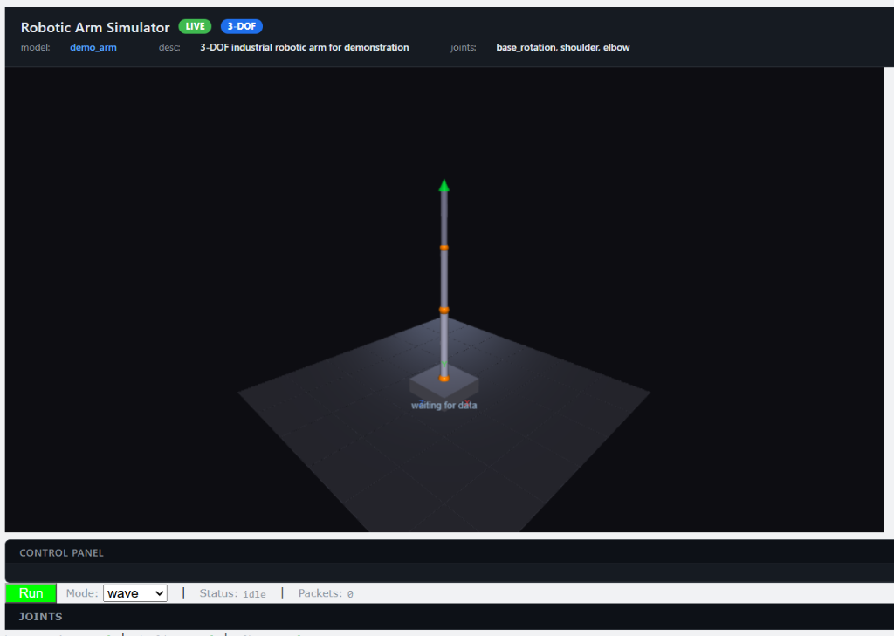

# Real-Time Industrial Robotic Arm 3D Simulator

> **Portfolio / Job Application**
> Python · UDP Sockets · VPython WebGL · Forward Kinematics · C Embedded Sender · JSON Configuration · OOP · 75 Unit Tests
>
> Run in under 2 minutes → see [Quick Start](#quick-start--running-the-simulator)

[](https://www.python.org/)
[](https://vpython.org/)
[](https://numpy.org/)
[](#wire-protocol-json-over-udp)
[](#c-udp-sender)
[](#automated-testing-suite)
[](#installation--setup)

A lightweight, high-performance real-time 3D kinematic simulator for multi-axis industrial robot arms. The system ingests joint telemetry over UDP from external controllers (written in C or Python), computes 3D forward kinematics via explicit rotation matrices, and renders an interactive, articulated robot arm in a browser-based WebGL viewport using VPython.

Built as a technical portfolio project demonstrating Python systems programming, UDP networking, 3D visualization, kinematic mathematics, and cross-language C integration.

---

## Table of Contents

- [Demo](#demo)
- [Key Capabilities](#key-capabilities)
- [System Architecture](#system-architecture)
- [Project Directory Structure](#project-directory-structure)
- [Technologies & Job Alignment](#technologies--job-alignment)
- [Wire Protocol (JSON over UDP)](#wire-protocol-json-over-udp)
- [Forward Kinematics Mathematics](#forward-kinematics-mathematics)
- [Robot Configuration System](#robot-configuration-system)
- [Installation & Setup](#installation--setup)
- [Quick Start & Running the Simulator](#quick-start--running-the-simulator)
- [C UDP Sender (Embedded Controller Simulation)](#c-udp-sender-embedded-controller-simulation)
- [Industrial Safety & Fault Tolerance](#industrial-safety--fault-tolerance)
- [Automated Testing Suite](#automated-testing-suite)
- [Limitations & Engineering Roadmap](#limitations--engineering-roadmap)
- [Portfolio / Job Application](#portfolio--job-application)

---

## Demo

**3D VPython WebGL scene — robot arm live in browser (wave mode, UDP streaming)**



📹 **[Watch the full demo video](screenshots/demo_simulation.mp4)**

> To run it yourself:
> ```bash
> # Terminal 1 — start the simulator
> python src/main.py
>
> # Terminal 2 — stream sinusoidal joint trajectories over UDP
> python sender/python_sender.py --mode wave
> ```

---

## Key Capabilities


- **Real-Time UDP Telemetry Ingestion**: Dedicated background receiver thread listens on UDP port `9999` with non-blocking thread-safe state synchronization (`threading.Lock`).
- **Data-Driven Kinematic Configuration**: Dynamic robot topology and link dimensions loaded from JSON configs—reconfigure or scale from 3-DOF to arbitrary serial chains without code modifications.
- **Rigorous Forward Kinematics Engine**: Vectorized 3D rotation matrices ($R_x, R_y, R_z$) chained iteratively to compute global Cartesian positions and orientations for every link and the end effector.
- **Interactive 3D WebGL Rendering**: Browser-based 3D scene built with VPython featuring real-time perspective controls, reference ground grid, RGB coordinate axis markers, and dynamic HUD status overlays.
- **Hardware-in-the-Loop (HIL) Ready**: Dual sender implementations (Python procedural animator and zero-dependency portable C sender) simulating embedded RTOS controllers.
- **Industrial Safety Enforcement**: Software angle clamping against mechanical joint limits (`min_angle`, `max_angle`) to prevent collision and out-of-envelope operations.
- **Robust Exception Handling**: Resilient to malformed JSON, corrupt UDP datagrams, invalid types, socket timeouts, and clean `SIGINT` (Ctrl+C) teardown.

---

## System Architecture

The simulator is built with a strictly decoupled pipeline separating network I/O from 3D visual rendering:

```
┌────────────────────────────────────────┐
│  Controller (C / Python UDP Sender)    │
│  Simulates Embedded Microcontroller/PLC │
└───────────────────┬────────────────────┘
                    │
                    │ UDP Datagrams (Default: 127.0.0.1:9999)
                    ▼
┌────────────────────────────────────────┐
│  UDP Server (Background Daemon Thread) │
│  - Non-blocking socket listener        │
│  - Thread-safe state update buffer     │
└───────────────────┬────────────────────┘
                    │
                    │ Raw Bytes (Max 4096 B)
                    ▼
┌────────────────────────────────────────┐
│  Packet Parser                         │
│  - UTF-8 decoding & JSON deserializer  │
│  - Field validation & error resilience │
│  - Outputs: JointUpdate dataclass      │
└───────────────────┬────────────────────┘
                    │
                    │ Validated Angles Dict
                    ▼
┌────────────────────────────────────────┐
│  Robot Model                           │
│  - Dynamic hierarchy from JSON config  │
│  - Software joint limit clamping       │
└───────────────────┬────────────────────┘
                    │
                    │ Joint Angles & Link Lengths
                    ▼
┌────────────────────────────────────────┐
│  Forward Kinematics Engine             │
│  - Cumulative 3x3 rotation matrices    │
│  - Global link endpoints & orientations│
└───────────────────┬────────────────────┘
                    │
                    │ 3D Vectors & Orientations
                    ▼
┌────────────────────────────────────────┐
│  VPython 3D Renderer (Main Thread)     │
│  - WebGL browser scene (60 FPS)        │
│  - Cylinders (links) & Spheres (joints)│
│  - End effector & real-time HUD telemetry
└────────────────────────────────────────┘
```

### Component Responsibilities

1. **`network/udp_server.py`**: Runs a daemon background thread to receive datagrams without blocking the main visualization loop. Uses thread locks to store the latest valid frame.
2. **`network/packet_parser.py`**: Validates input packets against the wire protocol schema. Discards invalid UTF-8, malformed JSON, or non-numeric joint values gracefully.
3. **`robot/robot_model.py`**: Holds robot state, manages individual `Joint` instances, and clamps commanded angles to physically permissible limits.
4. **`kinematics/forward_kinematics.py`**: Implements the kinematic transformation pipeline using pure matrix mathematics.
5. **`visualization/vpython_renderer.py`**: Instantiates 3D geometries and updates their 3D positions and directional vectors each frame.
6. **`main.py`**: Simulator entry point, argument parser, and high-frequency update loop coordinator (`vp.rate(60)`).

---

## Project Directory Structure

```
robotics-simulator/
├── README.md                      # Comprehensive project documentation
├── requirements.txt               # Production Python dependencies (vpython, numpy)
├── .gitignore                     # Git ignore patterns (bytecode, builds, artifacts)
├── config/
│   └── demo_arm.json              # 3-DOF articulated robot definition & geometry
├── src/
│   ├── __init__.py                # Package root
│   ├── main.py                    # Application entry point & render loop
│   ├── robot/
│   │   ├── __init__.py
│   │   ├── joint.py               # Joint data class with range constraints
│   │   ├── config_loader.py       # JSON configuration parser & validator
│   │   └── robot_model.py         # Articulated serial kinematic model
│   ├── kinematics/
│   │   ├── __init__.py
│   │   └── forward_kinematics.py  # Matrix-based forward kinematics engine
│   ├── network/
│   │   ├── __init__.py
│   │   ├── packet_parser.py       # UDP datagram parser -> JointUpdate
│   │   └── udp_server.py          # Multi-threaded non-blocking UDP receiver
│   └── visualization/
│       ├── __init__.py
│       └── vpython_renderer.py    # VPython WebGL 3D scene & HUD renderer
├── sender/
│   ├── python_sender.py           # Python test sender (wave, sweep, random)
│   └── c_sender.c                 # Cross-platform C UDP sender (Winsock/POSIX)
├── tests/
│   ├── __init__.py
│   ├── test_packet_parser.py      # UDP packet validation unit tests (12 tests)
│   ├── test_joint.py              # Joint behavior & limit clamping tests (15 tests)
│   ├── test_config_loader.py      # JSON schema loader & validation tests (11 tests)
│   ├── test_forward_kinematics.py # Kinematics trigonometry & matrix tests (17 tests)
│   └── test_robot_model.py        # Robot assembly & update tests (11 tests)
└── screenshots/                   # Simulation captures & demonstration media
```

---

## Technologies & Job Alignment

This project is tailored specifically to the requirements of the **Junior Robotics Simulation Developer** position in Addis Ababa:

| Job Requirement | Implementation in Simulator | Source File Reference |
| :--- | :--- | :--- |
| **Python 3 & Modern OOP** | Clean class hierarchies, encapsulation, type hints (`typing`), and dataclasses (`JointUpdate`, `RobotConfig`). | `src/robot/`, `src/network/` |
| **UDP Sockets & Networking** | Low-latency socket communication, multi-threaded background listener, thread-safe memory buffers, and configurable endpoints. | `src/network/udp_server.py` |
| **3D Rendering & Simulation** | Interactive WebGL 3D visualization using VPython, camera control, lighting, dynamic HUD, and synchronized frame-rate regulation. | `src/visualization/vpython_renderer.py` |
| **Vectors & Trigonometry** | 3D Cartesian coordinates, direction vectors, trigonometric rotations, orthogonal matrix multiplications, and coordinate frames. | `src/kinematics/forward_kinematics.py` |
| **Data-Driven Configuration** | Declarative JSON configuration system decoupling kinematics and visual properties from core simulation algorithms. | `src/robot/config_loader.py` |
| **C Compatibility & Embedded I/O** | Native C UDP sender utilizing standard C99, `sprintf()` packet construction, and cross-platform socket APIs (Winsock2 / POSIX). | `sender/c_sender.c` |
| **Quality Assurance & Testing** | 75 comprehensive automated unit tests covering matrix properties, boundary clamping, and fault injection. | `tests/` |

---

## Wire Protocol (JSON over UDP)

The simulator implements a streamlined, human-readable wire protocol designed for low latency and zero-dependency embedded C client integration.

### Datagram Specification

- **Transport**: UDP (User Datagram Protocol)
- **Default Port**: `9999`
- **Max Datagram Size**: `4096` bytes
- **Encoding**: UTF-8 plain text JSON string

### Payload Schema

```json
{
  "robot": "demo_arm",
  "timestamp": 1695900000,
  "joints": {
    "base_rotation": 30.0,
    "shoulder": 45.0,
    "elbow": -20.0
  }
}
```

### Fields

| Field | Type | Description |
| :--- | :--- | :--- |
| `robot` | `string` | Target robot identifier. Warns if mismatched with loaded configuration. |
| `timestamp` | `integer` | Unix epoch timestamp in seconds from the sending controller. |
| `joints` | `object` | Key-value mapping of joint names to target angles in **degrees**. |

### C Controller Integration

In embedded environments, external JSON libraries are often undesirable due to heap constraints. This protocol can be assembled with zero dynamic allocation using standard C `snprintf()` and dispatched via `sendto()`:

```c
char buffer[512];
snprintf(buffer, sizeof(buffer),
    "{\"robot\":\"%s\",\"timestamp\":%ld,\"joints\":{\"base_rotation\":%.2f,\"shoulder\":%.2f,\"elbow\":%.2f}}",
    "demo_arm", (long)time(NULL), base_deg, shoulder_deg, elbow_deg);

sendto(sockfd, buffer, strlen(buffer), 0, (struct sockaddr*)&dest_addr, sizeof(dest_addr));
```

---

## Forward Kinematics Mathematics

### Coordinate System & Conventions

- **Origin**: Center of base platform top surface $(0, 0, 0)$.
- **Default Link Alignment**: In the unrotated reference pose ($0^\circ$ on all joints), every link extends vertically along the **local $+Y$ axis**:
  $$\vec{v}_{\text{link}} = \begin{bmatrix} 0 \\ L_i \\ 0 \end{bmatrix}$$
- **Rotation System**: Right-handed Cartesian coordinate system. Rotations are evaluated in radians converted from degrees ($\theta_{\text{rad}} = \theta_{\text{deg}} \cdot \frac{\pi}{180}$).

### Standard 3D Rotation Matrices

For a joint with rotation angle $\theta$ around its designated axis:

#### X-Axis Rotation ($R_x$)
Used for pitch articulation (e.g., shoulder and elbow joints):
$$R_x(\theta) = \begin{bmatrix} 1 & 0 & 0 \\ 0 & \cos\theta & -\sin\theta \\ 0 & \sin\theta & \cos\theta \end{bmatrix}$$

#### Y-Axis Rotation ($R_y$)
Used for yaw articulation (e.g., base rotation joint):
$$R_y(\theta) = \begin{bmatrix} \cos\theta & 0 & \sin\theta \\ 0 & 1 & 0 \\ -\sin\theta & 0 & \cos\theta \end{bmatrix}$$

#### Z-Axis Rotation ($R_z$)
Used for roll articulation:
$$R_z(\theta) = \begin{bmatrix} \cos\theta & -\sin\theta & 0 \\ \sin\theta & \cos\theta & 0 \\ 0 & 0 & 1 \end{bmatrix}$$

### Forward Kinematics Chaining Algorithm

The forward kinematics solver iteratively walks from the robot's base to the end effector:

1. **Base Initialization**:
   - Starting position $\mathbf{p}_0 = \text{base\_top}$ (default $[0, 0.15, 0]$).
   - Cumulative orientation $R_{\text{cum}, 0} = I_{3\times3}$ (identity matrix).

2. **Iterative Joint Progression** (for joint $i = 1, \dots, N$):
   - Evaluate local rotation matrix $R_{\text{local}, i} = R_{\text{axis}_i}(\theta_i)$.
   - Accumulate orientation in world coordinates:
     $$R_{\text{cum}, i} = R_{\text{cum}, i-1} \cdot R_{\text{local}, i}$$
   - Compute link directional vector:
     $$\vec{d}_i = R_{\text{cum}, i} \cdot \begin{bmatrix} 0 \\ L_i \\ 0 \end{bmatrix}$$
   - Compute endpoint position:
     $$\mathbf{p}_i = \mathbf{p}_{i-1} + \vec{d}_i$$

3. **End Effector Location**:
   - The end effector position equals $\mathbf{p}_N$, pointing along direction $\vec{d}_N$.

### Mathematical Rigor Verified by Tests

The kinematics engine is verified against fundamental matrix algebra properties:
- **Determinant Check**: $\det(R) = 1.0$ (proper rigid rotation without reflection or scale distortion).
- **Orthogonality Check**: $R \cdot R^T = I_{3\times3}$ (preserves vector magnitudes and inner angles).

---

## Robot Configuration System

Robots are declared entirely within JSON files in the `config/` directory. The included configuration, `config/demo_arm.json`, specifies a 3-DOF articulated industrial arm:

```json
{
  "name": "demo_arm",
  "description": "3-DOF industrial robotic arm for demonstration",
  "base": {
    "position": [0.0, 0.0, 0.0],
    "width": 1.0,
    "height": 0.3,
    "depth": 1.0,
    "color": [0.35, 0.35, 0.4]
  },
  "joints": [
    {
      "name": "base_rotation",
      "axis": "y",
      "link_length": 1.5,
      "min_angle": -180.0,
      "max_angle": 180.0,
      "initial_angle": 0.0,
      "link_radius": 0.08,
      "joint_radius": 0.12,
      "link_color": [0.70, 0.70, 0.80],
      "joint_color": [1.00, 0.50, 0.00]
    },
    {
      "name": "shoulder",
      "axis": "x",
      "link_length": 1.2,
      "min_angle": -90.0,
      "max_angle": 90.0,
      "initial_angle": 0.0,
      "link_radius": 0.07,
      "joint_radius": 0.10,
      "link_color": [0.60, 0.60, 0.70],
      "joint_color": [1.00, 0.50, 0.00]
    },
    {
      "name": "elbow",
      "axis": "x",
      "link_length": 1.0,
      "min_angle": -135.0,
      "max_angle": 135.0,
      "initial_angle": 0.0,
      "link_radius": 0.06,
      "joint_radius": 0.08,
      "link_color": [0.50, 0.50, 0.60],
      "joint_color": [1.00, 0.50, 0.00]
    }
  ],
  "end_effector": {
    "radius": 0.10,
    "length": 0.20,
    "color": [0.00, 0.80, 0.20]
  }
}
```

### Adding New Robots

To define a custom robot (e.g., a 4-DOF SCARA or a 6-DOF arm):
1. Create a new JSON file: `config/my_robot.json`.
2. Append joint definitions to the `"joints"` list with appropriate `axis` (`"x"`, `"y"`, or `"z"`), `link_length`, and limit constraints.
3. Launch the simulator with `--config config/my_robot.json`. No Python source modifications are required.

---

## Installation & Setup

### Prerequisites

- **Python**: Version 3.8 or higher.
- **Web Browser**: Chrome, Firefox, Edge, or Safari with WebGL enabled.
- **C Compiler** *(Optional, for building the C sender)*: GCC, Clang, or MSVC.

### Environment Setup

1. **Clone or navigate to the repository**:
   ```bash
   cd "robotics-simulator"
   ```

2. **Create and activate a virtual environment** *(Recommended)*:
   ```bash
   # Windows (PowerShell)
   python -m venv venv
   .\venv\Scripts\Activate.ps1

   # Linux / macOS
   python3 -m venv venv
   source venv/bin/activate
   ```

3. **Install dependencies**:
   ```bash
   pip install -r requirements.txt
   ```
   *(Alternatively: `pip install vpython numpy`)*

---

## Quick Start & Running the Simulator

### Step 1: Launch the Simulator

Open a terminal and start the simulator server:

```bash
python src/main.py
```

*The simulator automatically spins up a local web server and launches your default browser at `http://localhost:8000` displaying the 3D robot arm, reference ground grid, coordinate axes, and status HUD.*

#### Simulator CLI Options

| Argument | Flag | Default | Description |
| :--- | :--- | :--- | :--- |
| `--config` | `-c` | `config/demo_arm.json` | Path to robot JSON configuration file |
| `--host` | | `127.0.0.1` | Network interface to bind UDP server |
| `--port` | `-p` | `9999` | Port to receive UDP joint packets |
| `--fps` | | `60` | Visualization refresh rate limit |

*Example with custom port and configuration:*
```bash
python src/main.py --config config/demo_arm.json --port 9999 --fps 60
```

---

### Step 2: Stream Joint Trajectories

Open a second terminal to run one of the sender controllers.

#### Option A: Python Trajectory Sender

The Python sender simulates continuous controller commands with three distinct animation profiles:

```bash
# 1. Harmonic Wave Mode (Default - smooth sinusoidal motion on all joints)
python sender/python_sender.py --mode wave

# 2. Sequential Joint Sweep Mode (Sweeps each joint through full min/max limits)
python sender/python_sender.py --mode sweep

# 3. Random Exploration Mode (Stochastic trajectory within safe limits)
python sender/python_sender.py --mode random
```

#### Python Sender CLI Options

| Argument | Flag | Default | Description |
| :--- | :--- | :--- | :--- |
| `--mode` | `-m` | `wave` | Animation mode (`wave`, `sweep`, `random`) |
| `--host` | | `127.0.0.1` | Target UDP host |
| `--port` | `-p` | `9999` | Target UDP port |
| `--rate` | `-r` | `30.0` | Packet transmission frequency (Hz) |
| `--speed`| `-s` | `1.0` | Motion speed multiplier |

---

## C UDP Sender (Embedded Controller Simulation)

A native C implementation (`sender/c_sender.c`) demonstrates how an embedded microcontroller, PLC, or real-time RTOS controller streams telemetry directly to the simulator.

### Compiling the C Sender

The C sender uses zero third-party dependencies and compiles with standard socket libraries across all major platforms:

#### Windows (Microsoft Visual C++ / MSVC)
```cmd
cl sender/c_sender.c /link ws2_32.lib
```

#### Windows (MinGW / GCC)
```bash
gcc sender/c_sender.c -o c_sender.exe -lws2_32
```

#### Linux / macOS (GCC or Clang)
```bash
gcc sender/c_sender.c -o c_sender -lm
```

### Running the C Sender

```bash
# Windows
.\c_sender.exe

# Linux / macOS
./c_sender
```

The C application transmits synchronized sinusoidal trajectories at ~30 Hz (`33 ms` interval), logging packet transmissions and angles to the console in real time.

---

## Industrial Safety & Fault Tolerance

The simulator incorporates safety mechanisms reflecting industrial automation standards:

1. **Angular Limit Enforcement (Soft Limits)**:
   - Every joint enforces configured hardware bounds (`min_angle` to `max_angle`).
   - If an external controller commands an angle outside permissible bounds, the joint model automatically clamps the value to the closest valid limit before kinematics calculation.
2. **Malformed Packet Immunity**:
   - Packets containing invalid UTF-8 bytes, corrupted JSON, or non-numeric joint values are rejected safely without crashing the UDP server.
   - Partial packets (missing specific joints) update only the supplied joints while maintaining existing states for omitted joints.
3. **Decoupled Concurrency**:
   - The networking thread and rendering loop operate independently. High-frequency network bursts or socket stalls cannot freeze the rendering pipeline.
4. **Graceful Teardown**:
   - Intercepts `SIGINT` (Ctrl+C) to safely terminate daemon threads, close network sockets, and release WebGL canvas contexts cleanly.

---

## Automated Testing Suite

The project includes an automated test suite containing **75 unit tests** verifying kinematics math, network protocol handling, configuration parsing, and error recovery.

### Running the Tests

Using Python's standard `unittest` framework:
```bash
python -m unittest discover tests/ -v
```

Or using `pytest`:
```bash
python -m pytest tests/ -v
```

### Test Suite Breakdown

```
tests/
├── test_packet_parser.py       (12 tests)
│   ├── Valid packet parsing & type casting
│   ├── Missing field defaults (robot, timestamp)
│   ├── Partial joint updates & negative angle handling
│   ├── Non-numeric/boolean value filtering
│   └── Malformed JSON and invalid UTF-8 rejection
├── test_joint.py               (15 tests)
│   ├── Angle initialization and boundary verification
│   ├── Out-of-bounds angle clamping (min/max limits)
│   ├── Invalid axis detection & type safety
│   └── Visual attribute fallback defaults
├── test_config_loader.py       (11 tests)
│   ├── demo_arm.json schema validation
│   ├── Missing required key detection ('name', 'joints')
│   ├── Negative link length rejection
│   └── Axis string validation ('x', 'y', 'z')
├── test_forward_kinematics.py  (17 tests)
│   ├── Rotation matrix identity at 0 radians
│   ├── 90-degree orthogonal axis transformations
│   ├── Matrix determinant verification (det(R) == 1.0)
│   ├── Matrix orthogonality condition (R @ R^T == I)
│   └── Multi-link serial kinematic chain calculations
└── test_robot_model.py         (11 tests)
    ├── Assembly from configuration objects
    ├── Partial joint angle updates
    ├── Unknown joint rejection
    └── Clamping integration with JointUpdate
```

*All 75 tests execute and pass in approximately 0.16 seconds.*

---

## Limitations & Engineering Roadmap

### Current Scope & Limitations

- **Degrees of Freedom**: Default demo is configured as a 3-DOF articulated arm (dynamically expandable to $N$-DOF via JSON).
- **Kinematic Domain**: Focuses on **Forward Kinematics** (joint space $\rightarrow$ Cartesian space).
- **Physics**: Pure kinematic simulation; does not model rigid body dynamics, joint torque/inertia, or collision geometry meshes.
- **Network Scope**: Designed for local or secured industrial subnetworks (unencrypted UDP datagrams).

### Engineering Roadmap

- [ ] **Inverse Kinematics (IK) Engine**: Implement analytical IK for 6-DOF industrial geometries and numerical IK (Damped Least Squares / Jacobian Pseudo-Inverse) for arbitrary serial chains.
- [ ] **Trajectory Interpolation**: Add cubic and quintic polynomial spline interpolation for smooth acceleration-bounded motion profiles.
- [ ] **Trajectory Recording & Playback**: Enable CSV/JSON recording of joint angles and Cartesian end-effector coordinates for offline analysis.
- [ ] **Gripper Actuation**: Add parameterized parallel-jaw and vacuum gripper visual models with grip state telemetry.
- [ ] **ROS 2 Integration**: Implement a `micro-ROS` / `ros2_control` hardware interface bridge mapping joint trajectories directly into standard ROS topics (`/joint_states`).
- [ ] **Collision Checking**: Integrate bounding-box and cylinder-capsule distance checking for self-collision and workcell boundary avoidance.

---

## Portfolio / Job Application

This project was built to demonstrate the following technical skills in a hands-on, runnable codebase:

| Skill Demonstrated | Where |
| :--- | :--- |
| Python 3 · OOP · type hints · dataclasses | `src/robot/`, `src/network/`, `src/kinematics/` |
| UDP socket programming (client & server) | `src/network/udp_server.py`, `sender/python_sender.py` |
| VPython — 3D WebGL rendering | `src/visualization/vpython_renderer.py` |
| Forward kinematics — rotation matrices, vectors, trig | `src/kinematics/forward_kinematics.py` |
| JSON-driven configuration | `config/demo_arm.json`, `src/robot/config_loader.py` |
| C/C99 — cross-platform UDP (Winsock2 / POSIX) | `sender/c_sender.c` |
| Automated unit testing — 75 tests | `tests/` |
| Multithreaded concurrency + thread-safe state | `src/network/udp_server.py` |


**Author:** Eyob Kassaye — B.Sc. Software Engineering Student, Addis Ababa University (Expected: June 2027)
**Contact:** ekassaye0461@gmail.com · +251 945 835 542
